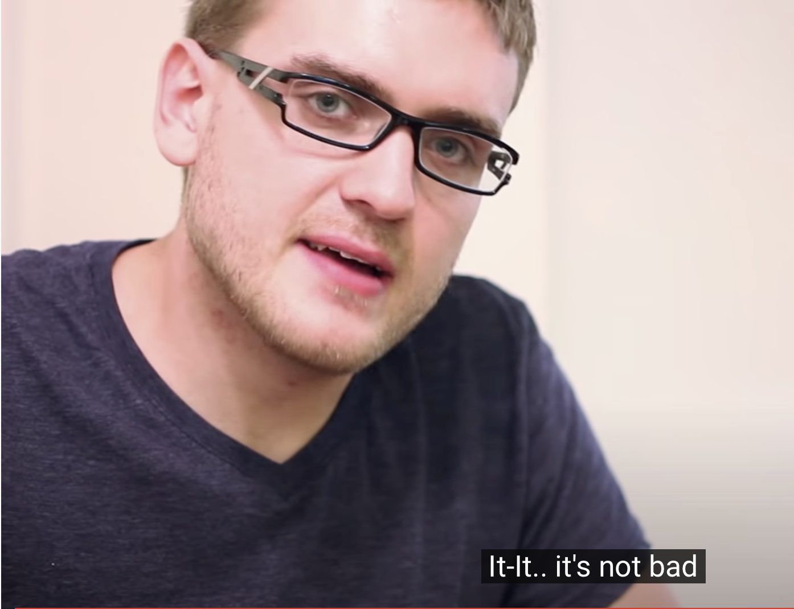

# Build Everything: $1500 Sandwich in 6 Months

youtube channel “How to Make Everything” demonstrated how taking the “build” mentality to the absolute extreme can lead to ridiculous outcomes. His process involved harvesting and milling his own wheat to make the bread, killing his own chicken, and planting a garden to grow ingredients. in the end, the sandwich was “not bad” and consumed 6 months of his life.

<figure><figcaption></figcaption></figure>
